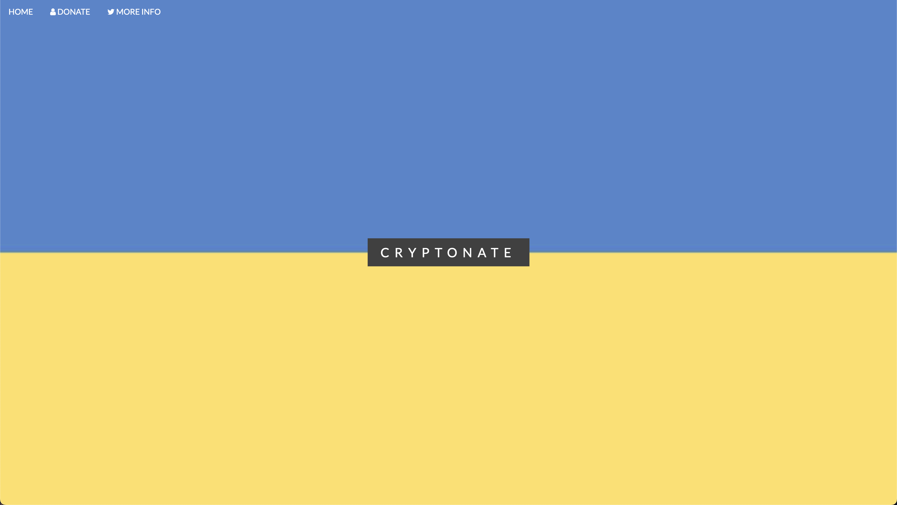

# [Cryptonate](https://relaxed-custard-6b3462.netlify.app/)
## [Demonstration Video](https://www.youtube.com/watch?v=hkwhaFEHS-k&ab_channel=YusufMorsi)

## Inspiration
Inspired by the tweet posted by Ukraine stating their acceptance of cryptocurrency donations, we developed this site in order to simplify the process. A combination of the words "cryptocurrency" and "donate," this site aims to encourage cryptocurrency donations to Ukraine.
## What it does
Using JavaScript, our site prompts the Moralis Metamask Log In extension, which allows users to send cryptocurrency to the address provided by Ukraine.
## How we built it
We built our site using HTML, CSS, JavaScript, and Moralis.io.
## Challenges we ran into
The main challenge that we ran into was creating a button that directly sends cryptocurrency funds to the Ukraine address, but we solved this issue by using the Metamask Log In prompt.
## Accomplishments that we're proud of
Our main accomplishment is being able to implement a novel application of cryptocurrency in a site to help Ukraine.
## What we learned
One of the many things we learned about in the creation of this site is setting up cryptocurrency wallets and connecting them to JavaScript buttons.
## What's next for Cryptonate
We hope to implement features that allow the users to donate in all sorts of cryptocurrencies ranging from Bitcoin to Dogecoin.
